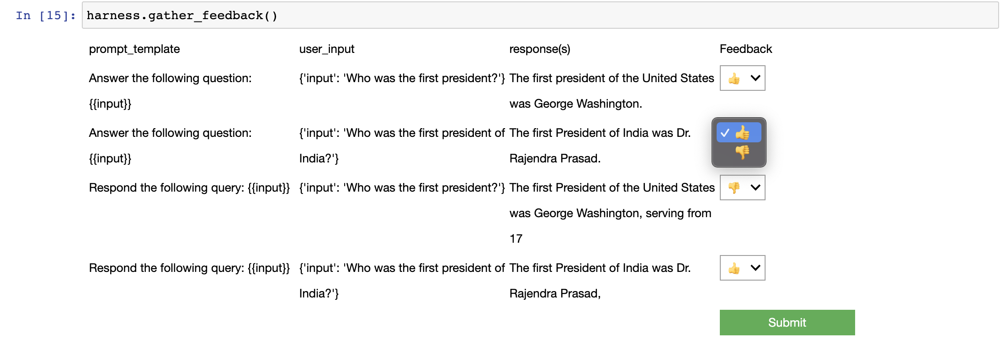

<p align="center">
  <a href="https://hegel-ai.com"></a>
</p>
<h1 align="center">
 PromptTools
</h1>
<p align="center">
:wrench: Test and experiment with prompts, LLMs, and vector databases. :hammer:
<p align="center">
  <a href="http://prompttools.readthedocs.io/"></a>
  <a href="https://discord.gg/7KeRPNHGdJ"></a>
  <a href="https://pepy.tech/project/prompttools" target="_blank"></a>
  <a href="https://pepy.tech/project/prompttools">
    
  </a>
  <a href="https://github.com/hegelai/prompttools">
      
  </a>
  <a href="https://twitter.com/hegel_ai"></a>
</p>


Welcome to `prompttools` created by [Hegel AI](https://hegel-ai.com/)! This repo offers a set of free, open-source tools for testing and experimenting with prompts. The core idea is to enable developers to evaluate prompts using familiar interfaces like _code_ and _notebooks_.

To stay in touch with us about issues and future updates, join the [Discord](https://discord.gg/7KeRPNHGdJ).

## Quickstart

To install `prompttools`, you can use `pip`:

```
pip install prompttools
```

You can run a simple example of a `prompttools` locally with the following

```
git clone https://github.com/hegelai/prompttools.git
cd prompttools && jupyter notebook examples/notebooks/OpenAIChatExperiment.ipynb
```

You can also run the notebook in [Google Colab](https://colab.research.google.com/drive/1YVcpBew8EqbhXFN8P5NaFrOIqc1FKWeS?usp=sharing)

## Using `prompttools`

There are primarily two ways you can use `prompttools` in your LLM workflow:

1. Run experiments on top of LLMs or vector databases in [notebooks](/examples/notebooks/) and evaluate the outputs.
2. Turn evaluations into [unit tests](/examples/prompttests/test_openai_chat.py) and integrate them into your CI/CD workflow [via Github Actions](/.github/workflows/ci.yml).

### Notebooks

There are a few different ways to run an experiment in a notebook.

The simplest way is to define an experimentation harness and an evaluation function:

```python
from prompttools.harness import PromptTemplateExperimentationHarness
from prompttools.utils import similarity

prompt_templates = [
    "Answer the following question: {{input}}",
    "Respond the following query: {{input}}"
]

user_inputs = [
    {"input": "Who was the first president?"},
    {"input": "Who was the first president of India?"}
]

harness = PromptTemplateExperimentationHarness("text-davinci-003",
                                               prompt_templates,
                                               user_inputs)


harness.run()
harness.evaluate("semantic_similarity", similarity.evaluate)
harness.visualize()
```

You should get a table that looks like this.


For a full example, please see this [semantic similarity comparison](/examples/notebooks/SemanticSimilarity.ipynb).

All our [notebook examples are here](/examples/notebooks/):


If you are interested to compare different models, the [ModelComparison example](/examples/notebooks/ModelComparison.ipynb) may be of interest.

For an example of built-in evaluation function, please see this example of [semantic similarity comparison](/examples/notebooks/SemanticSimilarity.ipynb) for details.

We also have examples assessing the outputs of vector databases (e.g. [Chroma](/examples/notebooks/ChromaDBExperiment.ipynb) and [Weaviate](/examples/notebooks/WeaviateExperiment.ipynb)).

You can also manually enter feedback to evaluate prompts, see [HumanFeedback.ipynb](/examples/notebooks/HumanFeedback.ipynb).



> Note: Above we used an `ExperimentationHarness`. Under the hood, that harness uses an `Experiment` to construct and make API calls to LLMs. The harness is responsible for managing higher level abstractions, like prompt templates or system prompts. To see how experiments work at a low level, [see this example](/examples/notebooks/OpenAIChatExperiment.ipynb).

### Using `prompttools` for Continuous Testing

Unit tests in `prompttools` are called `prompttests`. They use the `@prompttest` annotation to transform an evaluation function into an efficient unit test. The `prompttest` framework executes and evaluates experiments so you can test prompts over time. You can see an example test [here](/examples/prompttests/test_openai_chat.py) and an example of that test being used as a Github Action [here](/.github/workflows/post-commit.yaml).

### Persisting Results

To persist the results of your tests and experiments, you can export your `Experiment` with the methods `to_csv`,
`to_json`, or `to_lora_json`. We are happy to further discuss your use cases, pain points, and what export
options may be useful for you.

### Setting API keys

If you would like to use a remote API (e.g. OpenAI, Anthropic), you will need to bring your own OpenAI API key.
This is because `prompttools` makes a call to those APIs directly from your machine.

In Python, you can set:
```python
import os
os.environ['OPENAI_API_KEY'] = ""
```

In command line:
```
OPENAI_API_KEY=sk-... python examples/prompttests/test_openai_chat.py
```

You will find [more examples of these in our notebooks](/examples/notebooks/).

### Documentation

Our [documentation website](https://prompttools.readthedocs.io/en/latest/index.html) contains the full API reference
and more description of individual components. Check it out!

## Supported Integrations

Here is a list of APIs that we support with our experiments:

LLMs
- OpenAI (Completion, ChatCompletion) - **Supported**
- LLaMA.Cpp (LLaMA 1, LLaMA 2) - **Supported**
- HuggingFace (Hub API, Inference Endpoints) - **Supported**
- Anthropic - Planned
- Google PaLM API - Planned

Vector Databases
- Chroma - **Supported**
- Weaviate - **Supported**
- Milvus - Exploratory
- Pinecone - Exploratory
- LanceDB - Exploratory

If you have any API that you'd like to see being supported soon, please open an issue or
a PR to add it. Feel free to discuss in our Discord channel as well.

## Installation

To install `prompttools` using pip:

```bash
pip install prompttools
```

To install from source, first clone this GitHub repo to your local machine, then, from the repo, run:

```bash
pip install .
```

You can then proceed to run [our examples](/examples/notebooks/).

### Frequently Asked Questions (FAQs)

1. Will this library forward my LLM calls to a server before sending it to OpenAI, Anthropic, and etc.?
    - No, the source code will be executed on your machine. Any call to LLM APIs will be directly executed from your machine without any forwarding.

2. Does `prompttools` store my API keys or LLM inputs and outputs to a server?
    - No, all data stay on your local machine.

## Contributing

We welcome PRs and suggestions! Don't hesitate to open a PR/issue or to reach out to us [via email](mailto:team@hegel-ai.com).
Please have a look at our [contribution guide](CONTRIBUTING.md) and
["Help Wanted" issues](https://github.com/hegelai/prompttools/issues?q=is%3Aopen+is%3Aissue+label%3A%22help+wanted%22) to get started!

## Usage and Feedback

We will be delighted to work with early adopters to shape our designs. Please reach out to us [via email](mailto:team@hegel-ai.com) if you're
interested in using this tooling for your project or have any feedback.

## License

We will be gradually releasing more components to the open-source community. The current license can be found in the  [LICENSE](LICENSE) file. If there is any concern, please [contact us](mailto:eam@hegel-ai.com) and we will be happy to work with you.
