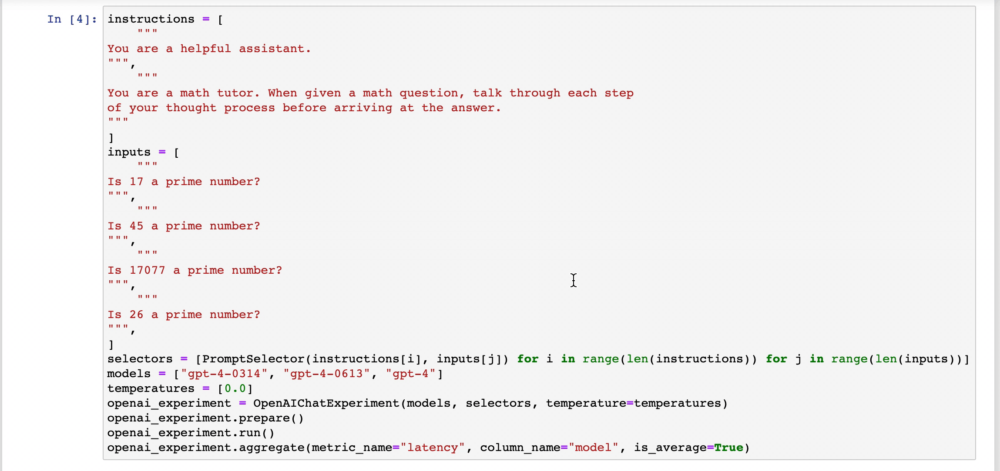

<h1 align="center">
 <a href="https://hegel-ai.com">
 <picture>
  <source media="(prefers-color-scheme: dark)" srcset="img/hegel_ai_logo_dark.svg">
  
 </picture>
 </a>
 <br>
 PromptTools
</h1>
<p align="center">
:wrench: Test and experiment with prompts, LLMs, and vector databases. :hammer:
<p align="center">
  <a href="http://prompttools.readthedocs.io/"></a>
  <a href="https://discord.gg/7KeRPNHGdJ"></a>
  <a href="https://pepy.tech/project/prompttools" target="_blank"></a>
  <a href="https://github.com/hegelai/prompttools">
      
  </a>
  <a href="https://twitter.com/hegel_ai"></a>
</p>


Welcome to `prompttools` created by [Hegel AI](https://hegel-ai.com/)! This repo offers a set of open-source, self-hostable tools for experimenting with, testing, and evaluating LLMs, vector databases, and prompts. The core idea is to enable developers to evaluate using familiar interfaces like _code_, _notebooks_, and a local _playground_.

In just a few lines of codes, you can test your prompts and parameters across different models (whether you are using
OpenAI, Anthropic, or LLaMA models). You can even evaluate the retrieval accuracy of vector databases.

```python
prompts = ["Tell me a joke.", "Is 17077 a prime number?"]
models = ["gpt-3.5-turbo", "gpt-4"]
temperatures = [0.0]
openai_experiment = OpenAIChatExperiment(models, prompts, temperature=temperatures)
openai_experiment.run()
openai_experiment.visualize()
```




To stay in touch with us about issues and future updates, join the [Discord](https://discord.gg/7KeRPNHGdJ).

## Quickstart

To install `prompttools`, you can use `pip`:

```
pip install prompttools
```

You can run a simple example of a `prompttools` locally with the following

```
git clone https://github.com/hegelai/prompttools.git
cd prompttools && jupyter notebook examples/notebooks/OpenAIChatExperiment.ipynb
```

You can also run the notebook in [Google Colab](https://colab.research.google.com/drive/1YVcpBew8EqbhXFN8P5NaFrOIqc1FKWeS?usp=sharing)

## Playground

<p align="center">
  
</p>

If you want to interact with `prompttools` using our playground interface, you can launch it with the following commands.

First, install prompttools:

```
pip install prompttools
```

Then, clone the git repo and launch the streamlit app:

```
git clone https://github.com/hegelai/prompttools.git
cd prompttools && streamlit run prompttools/playground/playground.py
```

You can also access a hosted version of the playground on the [Streamlit Community Cloud](https://prompttools.streamlit.app/).

> Note: The hosted version does not support LlamaCpp

## Documentation

Our [documentation website](https://prompttools.readthedocs.io/en/latest/index.html) contains the full API reference
and more description of individual components. Check it out!

## Supported Integrations

Here is a list of APIs that we support with our experiments:

LLMs
- OpenAI (Completion, ChatCompletion) - **Supported**
- LLaMA.Cpp (LLaMA 1, LLaMA 2) - **Supported**
- HuggingFace (Hub API, Inference Endpoints) - **Supported**
- Anthropic - **Supported**
- Google PaLM - **Supported**
- Azure OpenAI Service - **Supported**
- Replicate - _In Progress_
- Ollama - _In Progress_

Vector Databases and Data Utility
- Chroma - **Supported**
- Weaviate - **Supported**
- Qdrant - **Supported**
- LanceDB - **Supported**
- Milvus - Exploratory
- Pinecone - Exploratory

Frameworks
- LangChain - **Supported**
- MindsDB - **Supported**
- LlamaIndex - Exploratory

Computer Vision
- Stable Diffusion - **Supported**
- Replicate's hosted Stable Diffusion - _In Progress_

If you have any API that you'd like to see being supported soon, please open an issue or
a PR to add it. Feel free to discuss in our Discord channel as well.

## Frequently Asked Questions (FAQs)

1. Will this library forward my LLM calls to a server before sending it to OpenAI, Anthropic, and etc.?
    - No, the source code will be executed on your machine. Any call to LLM APIs will be directly executed from your machine without any forwarding.

2. Does `prompttools` store my API keys or LLM inputs and outputs to a server?
    - No, all of those data stay on your local machine. We do not collect any PII (personally identifiable information).

3. How do I persist my results?
   -  To persist the results of your tests and experiments, you can export your `Experiment` with the methods `to_csv`,
      `to_json`, `to_lora_json`, or `to_mongo_db`. We are building more persistence features and we will be happy to further discuss your use cases, pain points, and what export
      options may be useful for you.

## Sentry
<details>
  <summary><b>Usage Tracking</b></summary>

Since we are changing our API rapidly, there are some errors caused by our negligence or out of date documentation.
To improve user experience, we collect data from normal package usage that helps us understand the
errors that are raised. This data is collected and sent to [Sentry](https://sentry.io/),
a third-party error tracking service, commonly used in open-source softwares. It only logs this library's own actions.

You can easily opt-out by defining an environment variable called `SENTRY_OPT_OUT`.

</details>

## Contributing

We welcome PRs and suggestions! Don't hesitate to open a PR/issue or to reach out to us [via email](mailto:team@hegel-ai.com).
Please have a look at our [contribution guide](CONTRIBUTING.md) and
["Help Wanted" issues](https://github.com/hegelai/prompttools/issues?q=is%3Aopen+is%3Aissue+label%3A%22help+wanted%22) to get started!

## Usage and Feedback

We will be delighted to work with early adopters to shape our designs. Please reach out to us [via email](mailto:team@hegel-ai.com) if you're
interested in using this tooling for your project or have any feedback.

## License

We will be gradually releasing more components to the open-source community. The current license can be found in the  [LICENSE](LICENSE) file. If there is any concern, please [contact us](mailto:eam@hegel-ai.com) and we will be happy to work with you.
